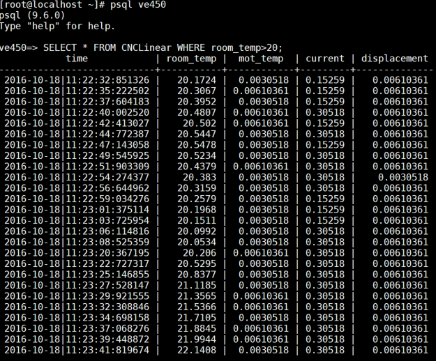

VE450 Team 4 Machine Learning Think and Speak

Author: Lu Zening
# How to deploy the server
## Install PostgreSQL
### On Windows
1. Download `postgresql-9.6-x86.exe` the executable installer.
2. Double-click.
3. Create a database named `ve450` owned by user `root`.
### On CentOS 6
1. Install PostgreSQL9.6 by command
    `sudo yum install postgres-9.6-i686`
2. Install PostgreSQL developer's kit
    `sudo yum install postgres_delevel`
3. Create a PostgreSQL user named *root*
    ```
    su - postgres
    createuser -d root
    exit
    ```
4. Create a database titled *ve450*
    ```
    su - root
    createdb ve450
    exit
    ```
---
## Conifgurate TCP/IP settings
1. Put all script files under the same folder.
2. Access the folder.
3. Open file *TCPconfig.py*, modify record `host_address=xxx.xxx.xxx.xxx` according to your host IP address. Save it.

## Start the server
1. Since the server uses the PostgreSQL database `ve450` to store sensor readings, please make sure you have created a database titled *ve450*.
2. Run command `python3 start_server.py` to run the services at the foreground. Run command `nohup python3 start_server.py &` to run the services at the background.
3. Power on the DTU module. The server will automatically connect to the module.
4. Once the connection is established, you will see data flows in.
5. Done for the server part.

    
---
## Inspect history sensor readings 
1. On the server, go back to the command line interface.
2. You can either terminate the server services or just put them to the background.
3. Run command `psql ve450` to access the database.
4. Type in the SQL command `SELECT * FROM CNCLinear;`, then hit *Enter*
5. All valid records will be printed on the terminal.
    


